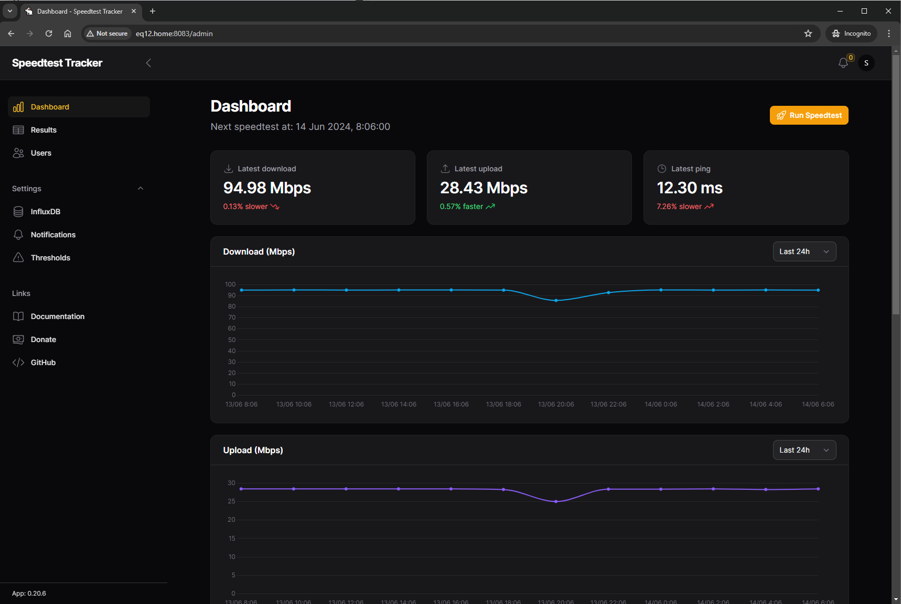

# 🐇 Speedtest Tracker

Speedtest Tracker is a self-hosted internet performance tracking application that runs speedtests using Ookla's Speedtest service.

[](https://star-history.com/#alexjustesen/speedtest-tracker&Date)

### Why might I use this?

The main use case for Speedtest Tracker is to build a history of your internet's performance so that you can be informed when you're not receiving your ISP's advertised rates.

### What about that other Speedtest Tracker?

As far as I can tell https://github.com/henrywhitaker3/Speedtest-Tracker was abandoned. This is meant to be an actively maintained replacement with an improved UI and feature set.

## Getting Started

Speedtest Tracker is containerized so you can run it anywhere you run your Docker containers. The [install](https://docs.speedtest-tracker.dev/getting-started/installation) documentation will get you up and running with using Docker or Docker Composer along with choosing a database (SQLite, MySQL/MariaDB or Postgresql).

### Quick Start

#### Docker

```bash
docker run -d --name speedtest-tracker --restart unless-stopped \
    -p 8080:80 \
    -e PUID=1000 \
    -e PGID=1000 \
    -e APP_KEY= \ # How to generate an app key: https://speedtest-tracker.dev/
    -e APP_URL=http://localhost \
    -e DB_CONNECTION=sqlite \
    -v ${PWD}:/config \
    lscr.io/linuxserver/speedtest-tracker:latest
```

#### Docker Compose

```bash
services:
    speedtest-tracker:
        container_name: speedtest-tracker
        ports:
            - 8080:80
            - 8443:443
        environment:
            - PUID=1000
            - PGID=1000
            - APP_KEY= # How to generate an app key: https://speedtest-tracker.dev/
            - APP_URL=http://localhost
            - DB_CONNECTION=sqlite
        volumes:
            - /path/to/data:/config
            - /path/to-custom-ssl-keys:/config/keys
        image: lscr.io/linuxserver/speedtest-tracker:latest
        restart: unless-stopped
```
## Image version

A full list of released versions can be found here: https://fleet.linuxserver.io/image?name=linuxserver/speedtest-tracker

For more environment configuration see the docs: https://docs.speedtest-tracker.dev/getting-started/environment-variables

### FAQs and Features

[FAQs](https://docs.speedtest-tracker.dev/faqs) and a full list of planned and completed [features](https://docs.speedtest-tracker.dev/getting-started/features) can be found in the [documentation](https://docs.speedtest-tracker.dev).

## API

A robust API is planned for a later release but as of `v0.11.8` a legacy endpoint `/api/speedtest/latest` which is used by home lab dashboards like [Homepage](https://github.com/benphelps/homepage) and [Organizr](https://github.com/causefx/Organizr/tree/v2-master).

## Screenshots


**Dashboard**
