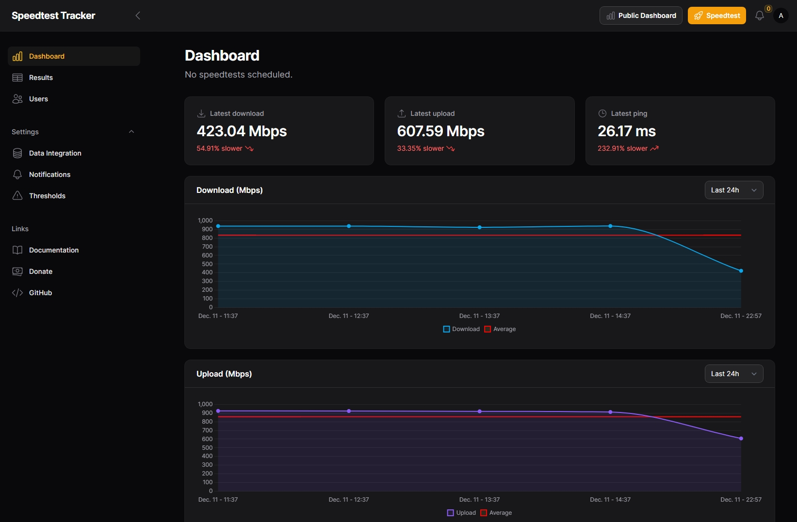

# 🐇 Speedtest Tracker

Speedtest Tracker is a self-hosted application that monitors the performance and uptime of your internet connection.

## Features

- **Automated Tests**: Schedule regular speed tests to monitor your internet connection's performance over time.
- **Detailed Metrics**: Capture download and upload speeds, ping, packet loss and more.
- **Historical Data**: View historical data and trends to identify patterns and issues with your internet connection.
- **Notifications**: Receive notifications when your internet performance drops below a certain threshold.

## Getting Started

Speedtest Tracker is containerized so you can run it anywhere you run your containers. The image is built by LinuxServer.io, build information can be found [here](https://fleet.linuxserver.io/image?name=linuxserver/speedtest-tracker).

- [Installation](https://docs.speedtest-tracker.dev/getting-started/installation) guide will get you up and running and includes steps for deploying the Docker image or to NAS platforms like Synology and Unraid.
- [Configurations](https://docs.speedtest-tracker.dev/getting-started/environment-variables) are used to tailor Speedtest Tracker to your needs.
- [Notifications](https://docs.speedtest-tracker.dev/settings/notifications) channels alert you when issues happen.
- [Frequently Asked Questions](https://docs.speedtest-tracker.dev/help/faqs) are common questions that can help you resolve issues.

