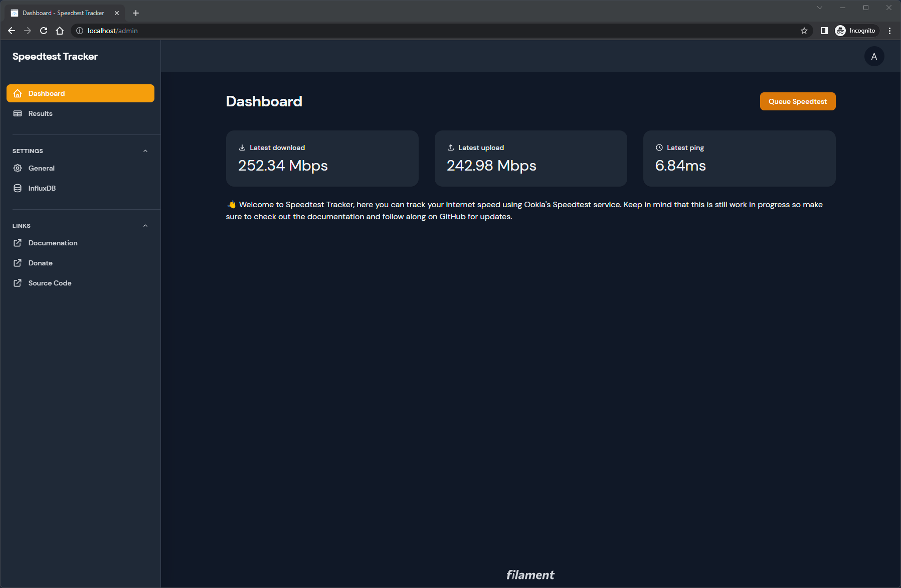
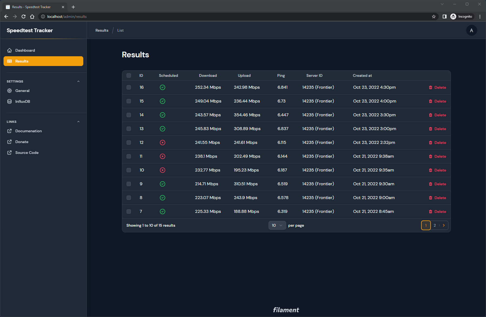
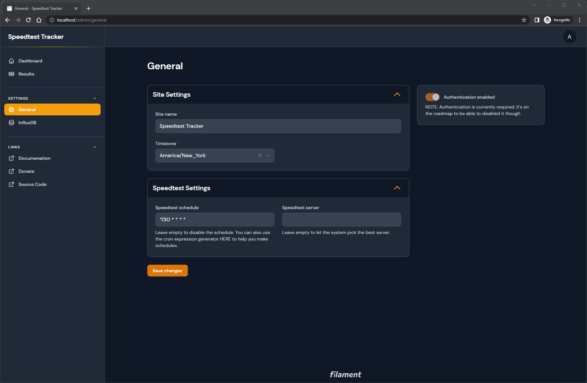

> **Warning**
> Wow what a couple of months it's been, thank you everyone for the support on my little side project. It's the holidays and I'm planning on taking a little time off from Dec. 23 - Jan 2nd so support will likely be slow or non-existent. I hope everyone has a happy holidays, see you all in 2023!

## Speedtest Tracker

Speedtest Tracker is a self-hosted internet performance tracking application that runs speedtest checks against Ookla's Speedtest service.

### Why might I use this?
The main use case for Speedtest Tracker is to build a history of your internet's performance so that you can be informed when you're not receiving your ISP's advertised rates.

### What about that other Speedtest Tracker?
As far as I can tell https://github.com/henrywhitaker3/Speedtest-Tracker was abandoned. This version is meant to be an actively maintained replacement with an improved UI and feature set.

### Documentation and Features
The docs can be found here https://docs.speedtest-tracker.dev to help you get started and also contains a full list of features.

### Screenshots
#### Dashboard

#### Results page

#### General Settings page

